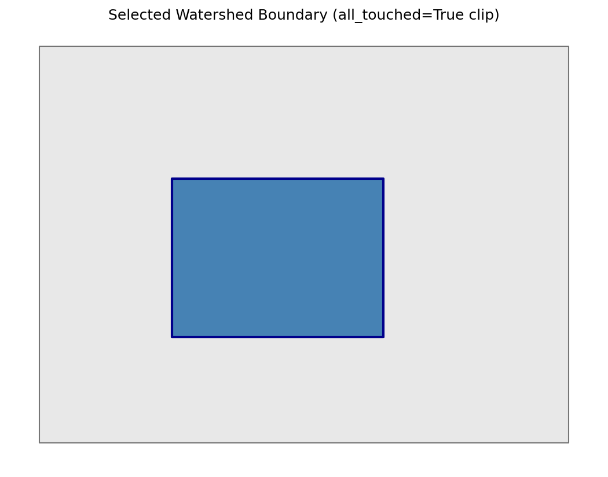
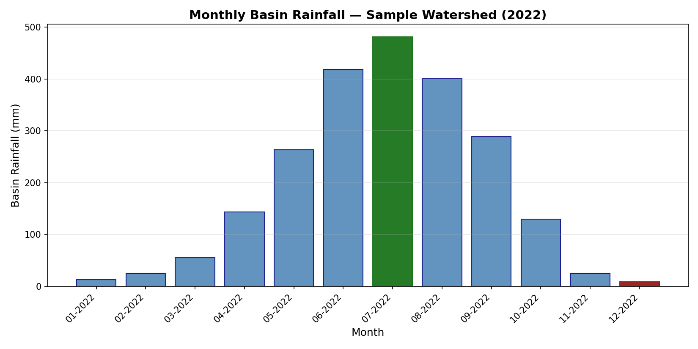
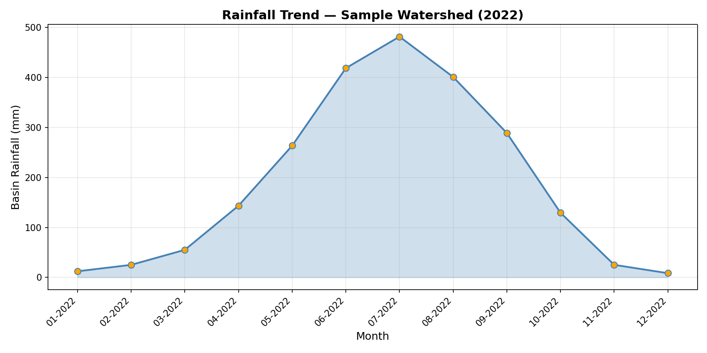

# Watershed Rainfall Analyzer v3.0

Research-grade area-weighted zonal statistics with Areal Reduction Factor (ARF) correction for hydrological analysis.

---

## Features

- **Area-weighted zonal statistics** — every pixel intersecting a basin polygon contributes proportionally to its overlap area, eliminating centroid-sampling bias.
- **Correct rainfall aggregation** — basin rainfall is the area-weighted spatial mean of pixel depths (mm), not a raw pixel sum — the latter has no physical meaning and scales with pixel count rather than actual rainfall.
- **ARF available but off by default** — Areal Reduction Factor methods exist for point-gauge-to-areal correction on request; they do not apply to gridded satellite/reanalysis rainfall and are disabled unless explicitly enabled. See [Methods](#areal-reduction-factor-arf--off-by-default-use-with-caution).
- **Equal-area CRS basin area** — basin areas computed in an equal-area projection (ESRI:54034, Behrmann) for geometrically accurate results regardless of geographic location.
- **Sentinel value detection** — automatic identification and masking of common sentinel/no-data values embedded in raster data (e.g. −9999, −32768, 65535).
- **Trend & change-point detection** — Mann-Kendall test, Sen's slope estimator, and Pettitt change-point test for rigorous temporal analysis.
- **Drought & variability indices** — Standardised Precipitation Index (SPI), Seasonality Index (SI), and Precipitation Concentration Index (PCI).
- **Interactive visualisation** — Plotly charts and Folium maps for exploratory data analysis and publication-quality figures.
- **NetCDF support** — read multi-band NetCDF rainfall grids via an optional `[netcdf]` extra.
- **Multi-format export** — results exported as CSV, GeoJSON, and GeoTIFF.
- **Provenance metadata in CSV** — every output file carries a header block recording the exact toolchain, parameters, and input hashes used to produce it.

---

## Installation

```bash
# Core dependencies
pip install -e .

# With NetCDF support (xarray + netCDF4)
pip install -e '.[netcdf]'

# Development dependencies (pytest, ruff, etc.)
pip install -e '.[dev]'
```

---

## Quick Start

**Option A — Streamlit app (recommended for interactive use):**

```bash
streamlit run watershed_analyzer/app.py
```

**Option B — Docker:**

```bash
docker-compose up
```

---

## Workflow

The analysis follows this sequence:

1. **Upload shapefile** — provide a basin or catchment boundary polygon (`.shp` + sidecar files or a `.zip` archive).
2. **Select region** — choose the geographic region from the uploaded basins.
3. **Upload DEM (optional)** — a digital elevation model GeoTIFF for elevation-dependent analyses and TWI computation.
4. **Upload rasters** — provide gridded rainfall data as GeoTIFF or NetCDF files.
5. **Configure settings** — specify ARF method, statistical tests, index parameters, and output options.
6. **Run analysis** — execute the full pipeline and download results.

---

## Methods

### Zonal Statistics

Zonal statistics are computed using `rasterio.mask` with `all_touched=True`, which ensures that every raster pixel whose boundary intersects the basin polygon is included in the calculation (Lam & De Cola, 1993). Rather than simple centroid sampling or binary inclusion, each pixel's contribution is weighted by the fraction of its area that lies inside the basin polygon, producing unbiased area-weighted estimates. Nodata values and common sentinel values (e.g. −9999, −32768, 65535) are detected and masked prior to aggregation.

> Lam, N. S.-N., & De Cola, L. (Eds.). (1993). *Fractals in Geography*. Prentice Hall.

### Areal Reduction Factor (ARF) — off by default, use with caution

ARF corrects **point rain-gauge** measurements into an areal-average estimate: a single gauge reading systematically overestimates the true spatial-mean rainfall as the area it's assumed to represent grows, because a point can't capture the spatial variability across a whole storm cell. ARF exists to correct for that gap between "one point" and "the whole basin."

**The rainfall rasters this tool ingests (CHIRPS, ERA5, IMERG, and similar gridded products) are not point-gauge data — each pixel is already a spatial estimate**, interpolated or retrieved over an area. Computing a zonal mean across those pixels is already the areal average; applying ARF on top double-corrects and biases results low, more severely for larger basins. The lookup-table method is additionally built for sub-daily storm-design durations (1/6/24-hour), which has no valid mapping onto monthly accumulated rainfall.

For these reasons, `DEFAULT_ARF_METHOD = "none"` — the raw spatial mean is reported as basin rainfall, with no reduction applied. The ARF methods remain available (`arf_method="srikanthan_mcmahon"` / `"usgs_reed"`) for the narrow case where you're working with point-gauge data interpolated onto a grid and can justify a storm duration — not for gridded satellite/reanalysis rainfall products.

> ⚠️ **Citation not independently verified.** The "Srikanthan & McMahon (2007)" ARF formula cited in this codebase could not be confirmed against the published literature — Srikanthan & McMahon's well-documented work is on stochastic rainfall/streamflow generation, and a web search turned up no ARF formula attributable to them under this citation. The volume/page numbers also differ between this README and the `arf.py` docstring, which is itself a sign the citation was never checked against a source. **Verify this citation yourself (or replace it with a confirmed source, e.g. Reed 1999 / USGS Water-Supply Paper 2375, or NERC Flood Studies Report) before relying on it in published work.**

### Basin Area Computation

Basin polygon areas are reprojected to an equal-area coordinate reference system — **ESRI:54034 (World Behrmann Cylindrical Equal-Area)** — before area computation. This guarantees that the reported basin area is geometrically accurate regardless of the basin's latitude, avoiding the distortions inherent in geographic (lat/lon) or projected (e.g. UTM) coordinates at global scale.

### Statistical Tests

| Test | Purpose | Reference |
|---|---|---|
| Mann-Kendall | Monotonic trend detection in time series | Mann, H. B. (1945). *Nonparametric tests against trend*. Econometrica, 13(3), 245–259. / Kendall, M. G. (1975). *Rank Correlation Methods* (4th ed.). Charles Griffin. |
| Sen's slope | Robust estimate of linear trend magnitude | Sen, P. K. (1968). Estimates of the regression coefficient based on Kendall's tau. *Journal of the American Statistical Association*, 63(324), 1379–1389. |
| Pettitt test | Single change-point detection in the mean of a time series | Pettitt, A. N. (1979). A non-parametric approach to the change-point problem. *Applied Statistics*, 28(2), 126–135. |
| SPI | Standardised meteorological drought index based on fitted gamma distribution | McKee, T. B., Doesken, N. J., & Kleist, J. (1993). *The relationship of drought frequency and duration to time scales*. AMS 8th Conference on Applied Climatology, 179–184. |
| SI | Seasonality Index characterising the temporal concentration of rainfall | Walsh, R. P. D., & Lawler, D. M. (1981). Rainfall seasonality: description, spatial patterns and change through time. *Weather*, 36(7), 201–208. |
| PCI | Precipitation Concentration Index measuring the irregularity of rainfall distribution across months | Oliver, J. E. (1980). Monthly precipitation distribution: a comparative index. *Professional Geographer*, 32(3), 300–309. |

### Elevation Analysis

When a DEM is provided, the tool fits an ordinary least-squares (OLS) regression between pixel elevation and rainfall to characterise orographic enhancement. The derived elevation–rainfall relationship (slope, R²) is reported alongside summary statistics. Additionally, a simplified Topographic Wetness Index (TWI) is computed using a D8 flow-accumulation algorithm, providing a first-order approximation of soil moisture potential across the basin.

---

## Limitations

- **ARF is an empirical approximation** — the Srikanthan & McMahon and Reed methods are derived from specific regional datasets. Regional calibration with local rain-gauge data is strongly recommended before applying ARF in operational flood estimation.
- **Area-weighted stats assume uniform pixel size** — the area-weighting calculation presumes all valid pixels have the same ground resolution. Mixed-resolution inputs should be resampled to a common grid beforehand.
- **SPI assumes gamma-distributed monthly rainfall** — the standard SPI computation fits a two-parameter gamma distribution to monthly totals. This assumption may be violated in arid or hyper-humid climates where zero-inflated or bimodal distributions are common.
- **No gauge-based bias correction applied** — gridded rainfall products are used as-is. Systematic biases relative to ground truth are not corrected unless the user pre-processes the rasters.
- **Sentinel value detection covers common values but not all possible** — the default list (−9999, −32768, −9999.0, 65535, etc.) catches the most frequent sentinel values found in CHIRPS, TRMM, IMERG, and similar products. Unusual or product-specific sentinel values must be specified by the user.
- **TWI uses a simplified D8 algorithm** — the Topographic Wetness Index is computed with a deterministic D8 flow direction model, not a multi-flow-direction (D-infinity) algorithm. This may lead to less realistic flow accumulation patterns in areas of low relief or divergent hillslopes.

---

## Screenshots

Example output from the fixed pipeline, generated from a synthetic 12-month rainfall series over a sample basin polygon (Bangladesh UTM zone, monsoon-shaped seasonal profile). These are real chart output from `core/zonal.py` and `matplotlib`, run on synthetic data — not mockups of the UI.

**Selected watershed boundary:**



**Monthly basin rainfall (area-weighted spatial mean, mm):**



**Rainfall trend line:**



> These charts were generated by running the actual `hydrologically_correct_zonal_stats()` function against synthetic rasters, not by capturing the live Streamlit UI. If you want real UI screenshots (sidebar, tabs, upload widgets), run `streamlit run watershed_analyzer/app.py` locally and capture your own with real data — that step needs to happen on your machine since it requires a browser.

---

## Changelog

### v3.0.1 (this update)
- **Fixed:** ARF was previously applied by default to gridded rainfall data, which is methodologically incorrect (ARF corrects point-gauge data, not already-gridded/satellite products). Default changed to `arf_method="none"`.
- **Fixed:** Chronological sorting of monthly rasters failed silently when filenames didn't match `MM-YYYY`; now surfaces a visible warning and attempts additional date formats, plus flags duplicate months that could skew trend/variability results.
- **Fixed:** Shapefile ZIP extraction now explicitly rejects entries that would resolve outside the extraction directory (zip-slip hardening).
- **Flagged, not resolved:** the Srikanthan & McMahon (2007) ARF citation could not be independently verified — see the Methods section above before citing it in published work.


```
watershed_analyzer/
├── core/          # Core analysis engine (zonal stats, ARF, indices)
├── ui/            # Streamlit interface components
├── tests/         # Unit and integration tests
├── app.py         # Streamlit application entry point
└── ...            # Configuration, utilities, data files
```

---

## Testing

```bash
pytest tests/
```

---

## Docker

```bash
docker-compose up
```

---

## Citation

If you use this software in your research, please cite it using the metadata provided in [`CITATION.cff`](CITATION.cff).

---

## License

MIT